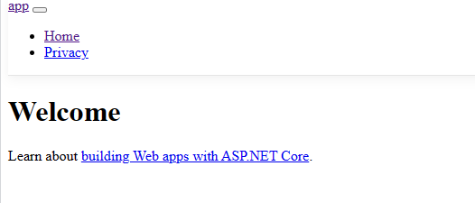
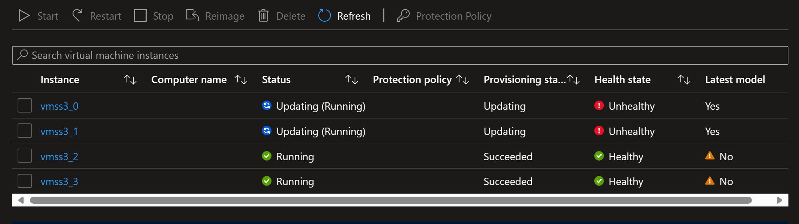
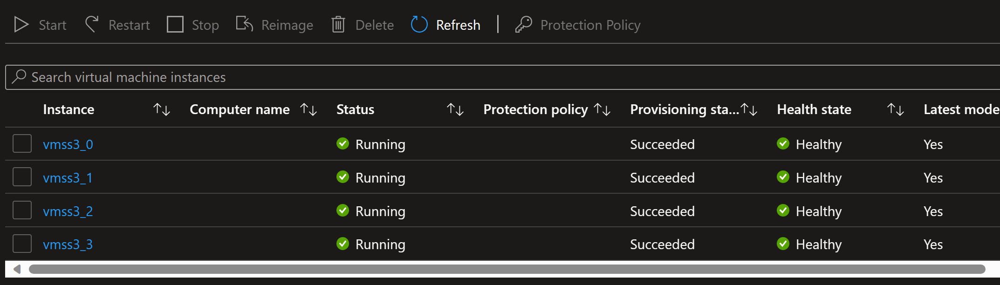
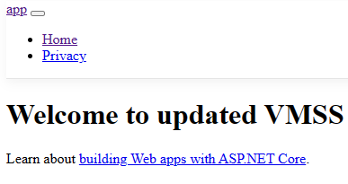
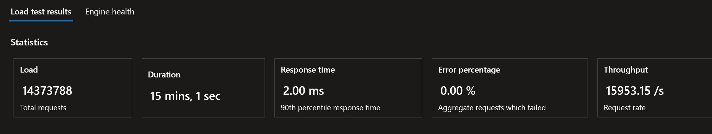

# Azure Scale Set (VMSS) app update with Custom Script Extension (Windows)

This sample provides an example of how to use Custom Script Extenion to update a **Windows** application running in Azure Virtual Machine Scale Sets (VMSS). It assumes the VMSS has been configured with Rolling Upgrades to prevent downtime. It also assumes Uniform VMSS mode but should be easily changed to support Flexible as well (more on that below).

It should not be treated as production-ready code, consider this an example only. Where applicable, links are included to the official docs for further reference.

# Table of Contents

- [Azure Scale Set (VMSS) app update with Custom Script Extension (Windows)](#azure-scale-set-vmss-app-update-with-custom-script-extension-windows)
- [Table of Contents](#table-of-contents)
- [Contents](#contents)
- [Instructions](#instructions)
  - [Before you begin - important info on Scale Sets](#before-you-begin---important-info-on-scale-sets)
    - [Using this repo with Flexible mode](#using-this-repo-with-flexible-mode)
- [Required Azure infrastructure for this example](#required-azure-infrastructure-for-this-example)
- [Creating the required Azure infrastructure](#creating-the-required-azure-infrastructure)
  - [Windows VM with IIS and ASP.NET Core](#windows-vm-with-iis-and-aspnet-core)
  - [Adding the VM image to a gallery](#adding-the-vm-image-to-a-gallery)
  - [Virtual Machine Scale Set](#virtual-machine-scale-set)
  - [Load Balancer](#load-balancer)
- [(Optional) - local run of the ASP.NET app](#optional---local-run-of-the-aspnet-app)
- [Behind the scenes](#behind-the-scenes)
- [Screenshots](#screenshots)
- [Contributing](#contributing)

# Contents

The focus of this example is on the `az vmss extension set` instruction and how to use artifacts uploaded to an Azure Storage account without a public endpoint to update an app running on VMSS.

In this repo:
* ASP.NET Core mvc application used as an example
* GitHub Actions workflow to build and deploy the app to Azure VMSS

Things that could be (a lot) better:
* IaC - no infra-as-code provided in this repo
* GitHub Actions workflow is a single job, could split into at least 2 - build and deploy
* **Missing ASP.NET web.config transforms for production** - this might be very important for your scenario but it's out of scope here.


# Instructions

## Before you begin - important info on Scale Sets

Azure Virtual Machine Scale Sets (VMSS) have 2 very different operation modes - Flecible and Uniform. They're [very well documented](https://learn.microsoft.com/en-us/azure/virtual-machine-scale-sets/virtual-machine-scale-sets-orchestration-modes) and Flexible is now the recommended one. However, given that Flexible is new and Uniform supports Rolling Upgrades, this repo assumes you have an Azure VMSS running in Uniform mode with Rolling Upgrades. 

### Using this repo with Flexible mode

If you want to use this repo with Flexible mode VMSS, remember that the upgrade policy is null when creating a Flexible VMSS. Which means you'll have to upgrade the instances after the `az vmss extension set` block in the workflow. 

An approach to do that would be to use the `az vmss reimage` command as [documented here](https://learn.microsoft.com/en-us/cli/azure/vmss?view=azure-cli-latest#az-vmss-reimage). Please beware, to avoid downtime, you'll have to reimage in batches and wait for those to come online before updating the next batch. Out of scope for this repo.

Stil, if you want to do it, include that command in the [workflow](.github/workflows/vmssupdate.yml) as a new step after the `az vmss extension set` one.

# Required Azure infrastructure for this example

* An Azure subscription :)
* A Virtual Machine image in a gallery. This VM image should have IIS and ASP.NET Core installed.
* An Azure VMSS created with Uniform mode and Rolling Upgrade policy.
* An Azure Load Balancer with a public IP or an Application Gateway that exposes a public endpoint and has a backend pool configured for the VMSS instances.
* (Optional) An Azure Bastion if you want to RDP into the individual instances (can be useful for debugging)

# Creating the required Azure infrastructure

Note: best practice would be to use IaC (infrastructure as code) to provision the required infrastructure. For this example, I didn't use it but you can look for examples in the official docs. 

## Windows VM with IIS and ASP.NET Core

TBD

## Adding the VM image to a gallery

Note: this step is not really mandatory and the ps1 script used in Custom Script Extenion could install all the required services and software to run the application. However, having a custom image significantly reduces startup, scaling and updating time of the VMSS.

TBD

## Virtual Machine Scale Set

TBD

## Load Balancer

Note: you can use an Azure Load Balancer or an Azure Application Gateway. For this example, I used an Azure Load Balancer.

# (Optional) - local run of the ASP.NET app

Just [download](https://dotnet.microsoft.com/en-us/download) the latest version of asp.net core (at this time, it's version 7), then, in a command prompt:

```
cd app
dotnet restore
dotnet run
```

# Behind the scenes

The GitHub Actions [workflow](.github/workflows/vmssupdate.yml) should be relatively easy to follow and I've added some comments there. Still, here's some noteworthy steps. Also, if you're using Azure DevOps, you can use the `az cli` commands like they're used here or check if there's specific Azure DevOps tasks for the job, but I won't cover that here.

# Screenshots

The example app will show a simple Welcome. Yes, CSS and JS is not working due to some IIS/ASP.NET configuration on the VM, but I'm not a Windows/IIS/ASP.NET expert and it's not essential for this example.



If you change something in the app (let's say the welcome message), and push it to the main branch of the repo (or merge a pull request, ideally!), the GitHub Actions [workflow](.github/workflows/vmssupdate.yml) gets triggered.

When the GitHub Actions [workflow](.github/workflows/vmssupdate.yml) is triggered, the az vmss set extension step will start updating the VMSS. You should see the first batch of instances being updated. 



When the command completes execution, all instances should now be updated, healthy and with the latest model.



The public endpoint of the VMSS should now show the updated app.



Just as a reference, here's an Azure Load Testing service running for 15 minutes while the update is taking place. As you can see, because we're using [rolling upgrade policy](https://learn.microsoft.com/en-us/azure/virtual-machine-scale-sets/virtual-machine-scale-sets-upgrade-policy?tabs=portal%2Cportal2%2Cportal3%2Cportal4), there's no downtime.



# Contributing

This could definitely be better, so you're welcome to open a pull request.

